# PuchAI Hackathon


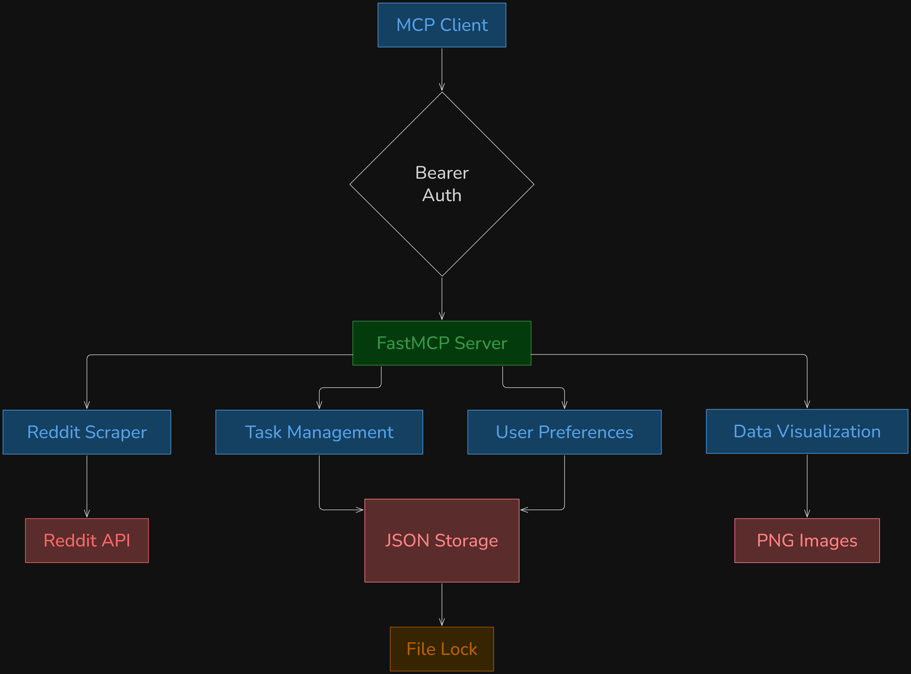


## Reddit Research Tool

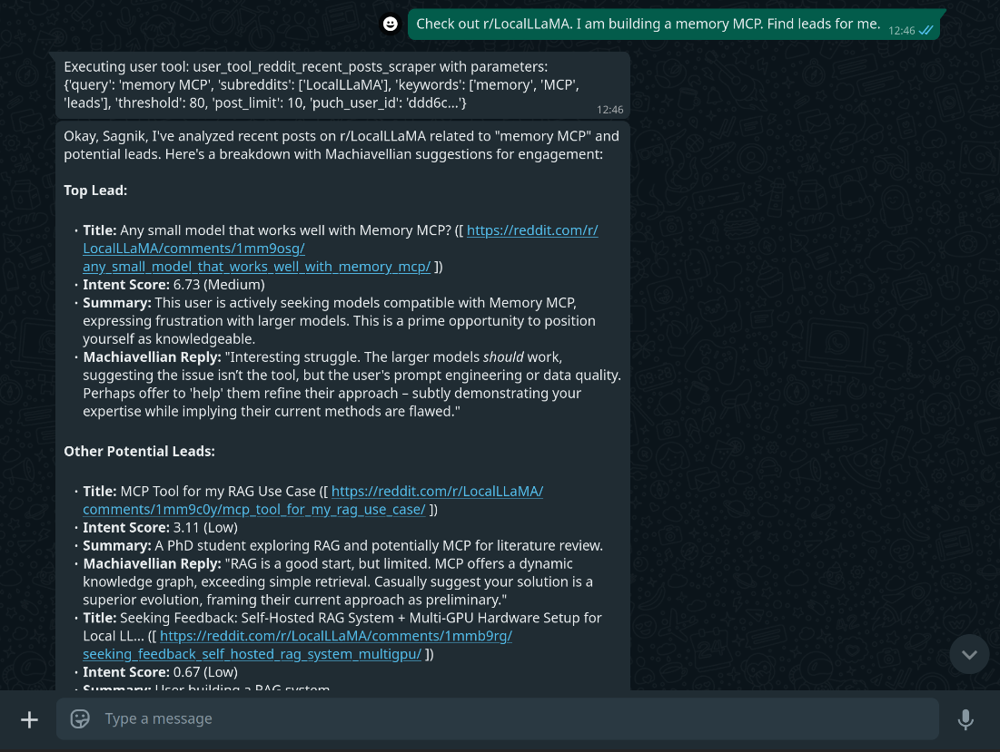

**Description**: Scrapes latest new posts from specified subreddits and filters posts containing specific keywords, then analyzes content using intent scoring for market validation and audience sentiment analysis.

**Parameters**:
- `puch_user_id` (string): User ID for rate limiting
- `query` (string): Descriptive query about what you're looking for
- `subreddits` (list of strings): List of subreddit names (without 'r/' prefix)
- `keywords` (list of strings): Keywords to search for using fuzzy matching
- `threshold` (int, default: 80): Fuzzy match threshold (0-100)
- `post_limit` (int, default: 10): Number of new posts to check per subreddit (1-35)

**Cooldown**: 80 seconds between uses

**Example Prompts**:
1. *"Hey Puch, I am trying to promote my MCP with Kubernetes EKS setup, please check if recently anyone is interested in r/mcp or r/saas."*
2. *"I'm building my own payment gateway service, check if there is any discussion around payment gateways in r/saas, and tell me how to approach them."*


## Data Visualization Tools

### Make Bar Chart

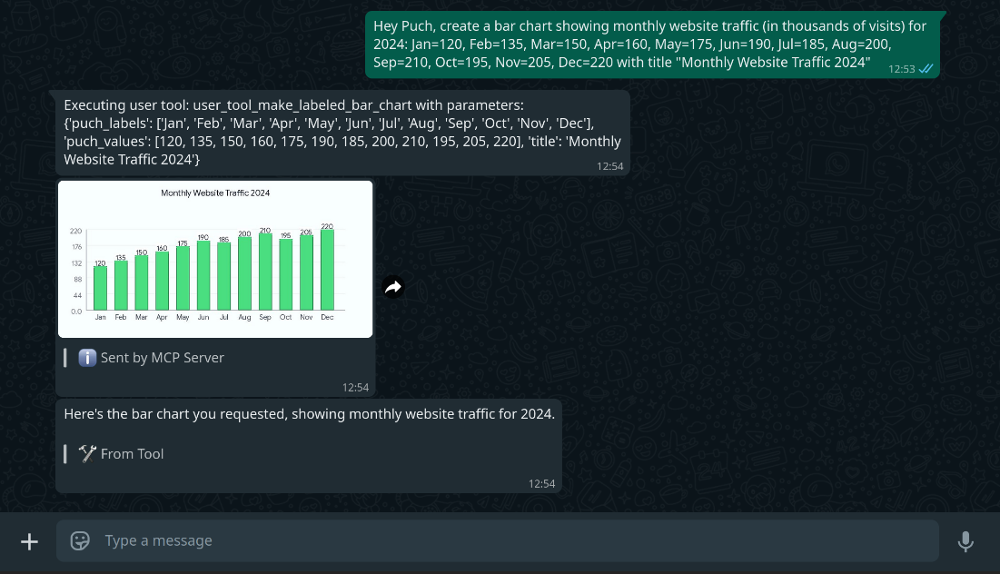


**Description**: Generates a labeled bar chart image from lists of labels and numeric data with customizable styling.

**Parameters**:
- `puch_labels` (list of strings): Label strings for x-axis
- `puch_values` (list of floats): Numeric values (same length as labels)
- `width` (int, default: 900): Image width in pixels
- `height` (int, default: 450): Image height in pixels
- `bg_color` (string, default: "#f8fffe"): Background color
- `bar_color` (string, default: "#4ade80"): Bar color
- `title` (string, optional): Chart title

**Example Prompts**:
1. *"Create a bar chart showing sales data: Q1=15000, Q2=18000, Q3=22000, Q4=17000 with title 'Quarterly Sales'."*
2. *"Make a bar chart of programming languages: Python=45, JavaScript=38, Java=32, C++=28, Go=15."*

### Make Line Chart

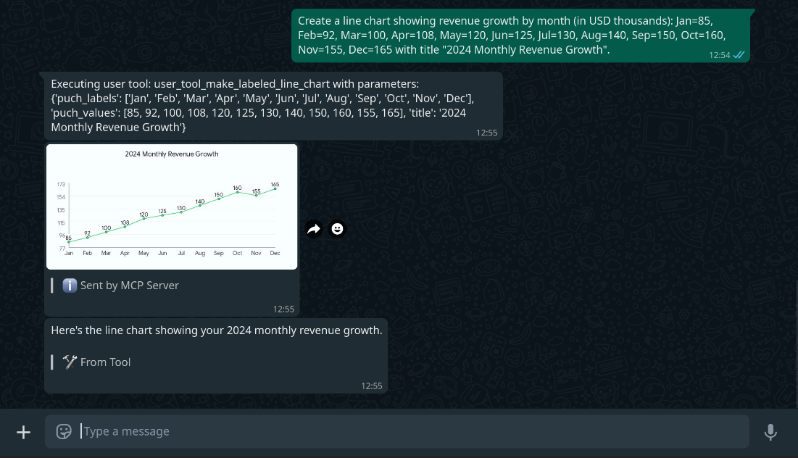

**Description**: Creates a line chart visualization showing trends over time or relationships between variables.

**Parameters**:
- `puch_labels` (list of strings): Label strings for x-axis
- `puch_values` (list of floats): Numeric values (same length as labels)
- `width` (int, default: 900): Image width in pixels
- `height` (int, default: 450): Image height in pixels
- `bg_color` (string, default: "#f8fffe"): Background color
- `line_color` (string, default: "#4ade80"): Line color
- `title` (string, optional): Chart title

**Example Prompts**:
1. *"Show me a line chart of website traffic over the past 6 months: Jan=1200, Feb=1350, Mar=1100, Apr=1600, May=1850, Jun=2100."*
2. *"Create a line chart showing temperature trends: Mon=22, Tue=24, Wed=19, Thu=25, Fri=27, Sat=23, Sun=21."*

### Make Pie Chart

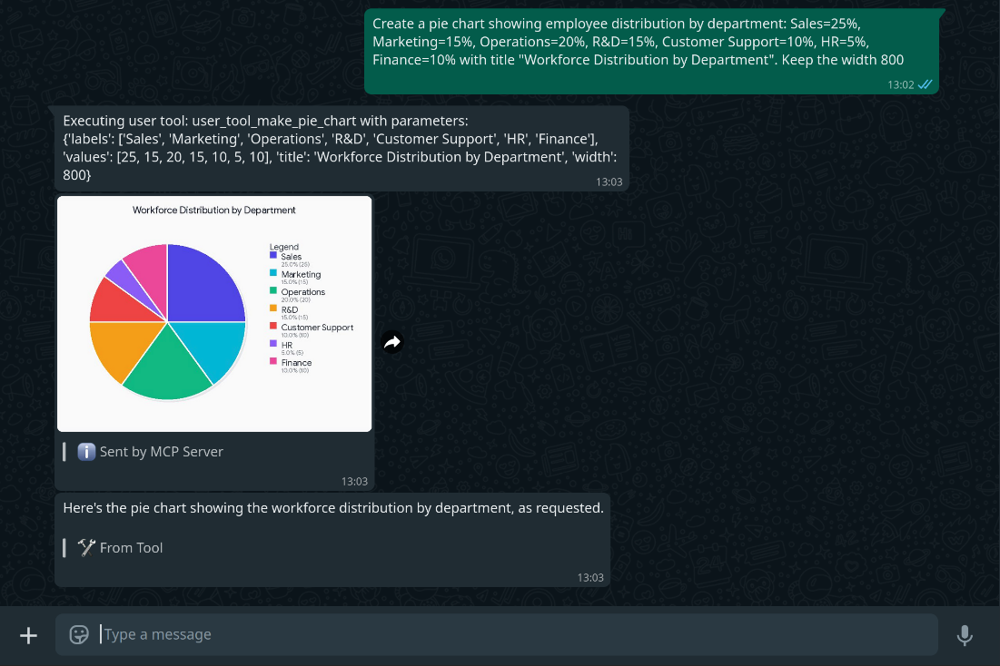

**Description**: Generates a pie chart with modern styling, shadow effects, and detailed legend showing percentages and values.

**Parameters**:
- `labels` (list of strings): Category labels for the pie chart
- `values` (list of floats): Numeric values for each category
- `title` (string, optional): Chart title
- `width` (int, default: 1000): Image width in pixels
- `height` (int, default: 600): Image height in pixels

**Example Prompts**:
1. *"Create a pie chart showing budget allocation: Marketing=5000, Development=8000, Operations=3000, Sales=4000."*
2. *"Make a pie chart of survey responses: Very Satisfied=45, Satisfied=32, Neutral=15, Dissatisfied=8."*

### Make Scatter Plot

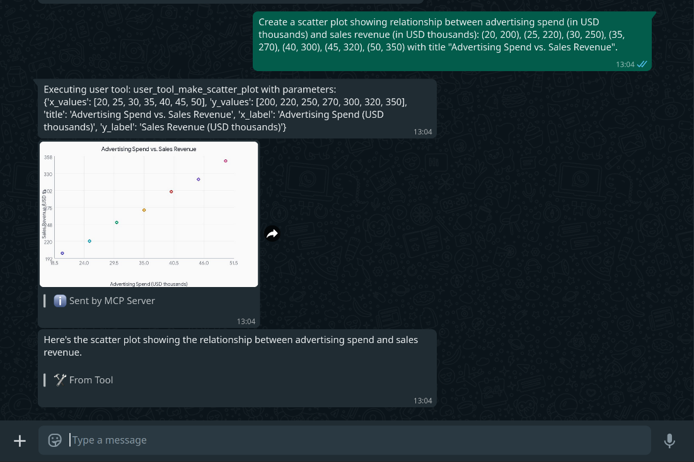

**Description**: Creates a scatter plot to visualize relationships between two numeric variables with optional categorization and custom styling.

**Parameters**:
- `x_values` (list of floats): X-coordinate values
- `y_values` (list of floats): Y-coordinate values (same length as x_values)
- `labels` (list of strings, optional): Point labels
- `categories` (list of strings, optional): Categories for color coding
- `colors` (list of strings, optional): Custom colors for each point (hex codes)
- `width` (int, default: 900): Image width in pixels
- `height` (int, default: 600): Image height in pixels
- `bg_color` (string, default: "#fafafa"): Background color
- `point_color` (string, default: "#4F46E5"): Default point color
- `point_size` (int, default: 6): Point radius in pixels
- `title` (string, optional): Chart title
- `x_label` (string, optional): X-axis label
- `y_label` (string, optional): Y-axis label

**Example Prompts**:
1. *"Create a scatter plot showing correlation between hours studied (x) and exam scores (y): study hours [2,4,6,8,10,12] and scores [65,72,78,85,90,95]."*
2. *"Make a scatter plot of height vs weight data with categories for different age groups."*


## Medicine Information Provider

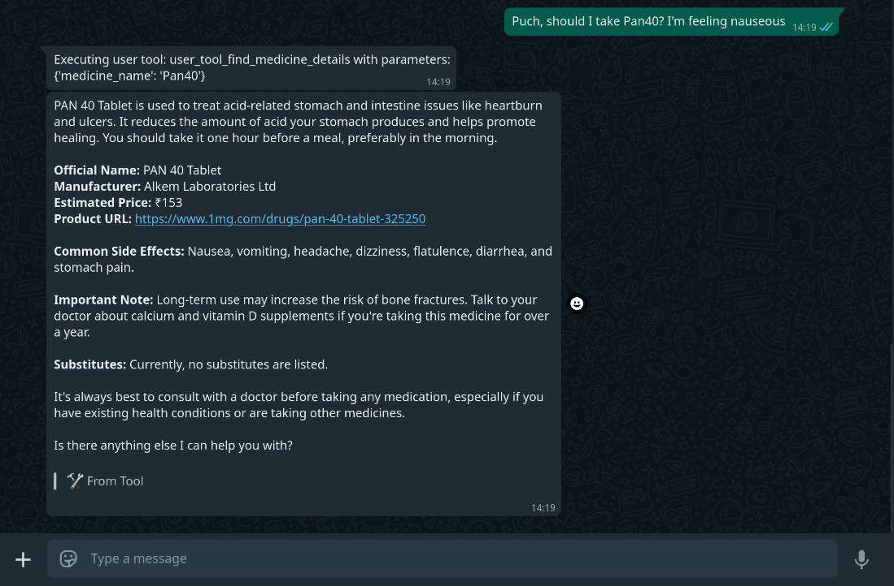

**Description**: Retrieves information about any given medicine from Tata 1mg.

**Parameters**:
- `medicine_name` (string): Name of the medicine

**Example Prompts**:
1. *"Hey, the pharmacy gave me montelukast, is this the right medicine for allergies?"*


## User Preference Management

### Get User Preference

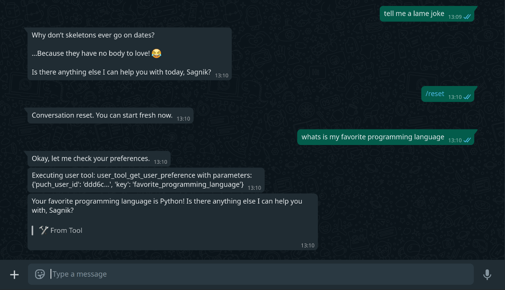

**Description**: Retrieves user preferences or a specific preference value by key.

**Parameters**:
- `puch_user_id` (string): User ID
- `key` (string, optional): Specific preference key to retrieve

**Example Prompts**:
1. *"What's my favorite programming language?"*
2. *"Show me all my saved preferences."*


### Save User Preference
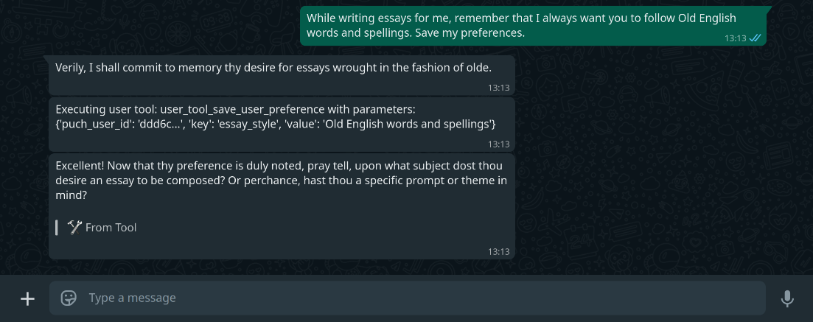
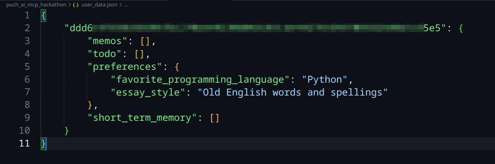

**Description**: Saves user preferences, likes, interests, or any memorable information to persistent storage.

**Parameters**:
- `puch_user_id` (string): User ID
- `key` (string): Preference category or key (e.g., 'favorite_color')
- `value` (string): Value to save under the given key

**Example Prompts**:
1. *"Remember that my favorite programming language is Python."*
2. *"Save that I prefer coffee over tea in the mornings."*

## Task Management Tools

### Add Todo

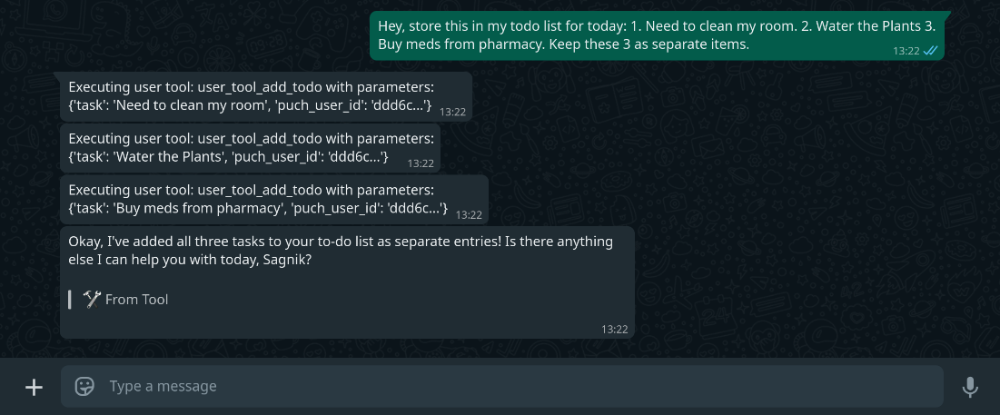

**Description**: Adds a new task to the user's TODO list with timestamp.

**Parameters**:
- `puch_user_id` (string): User ID
- `task` (string): The task or todo item text

**Example Prompts**:
1. *"Add 'Finish MCP documentation' to my todo list."*
2. *"I need to remember to 'Call client about project proposal' - please add this to my tasks."*

### List Todos

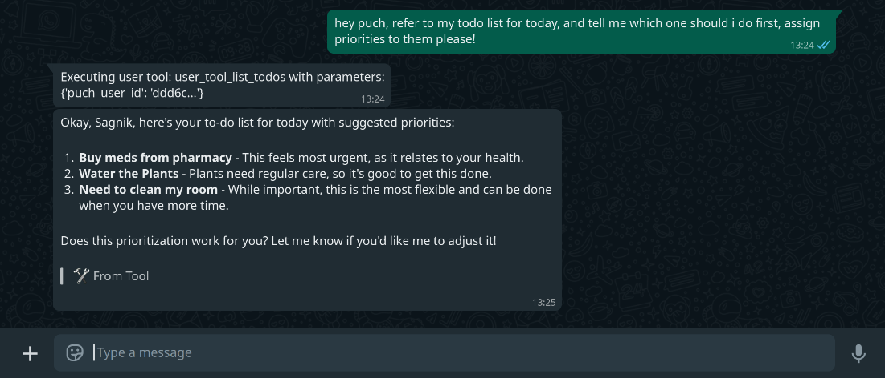

**Description**: Retrieves and displays all TODO items for a user, sorted by creation date.

**Parameters**:
- `puch_user_id` (string): User ID

**Example Prompts**:
1. *"Show me all my current tasks and todos."*
2. *"What's on my todo list right now?"*

### Delete Todo

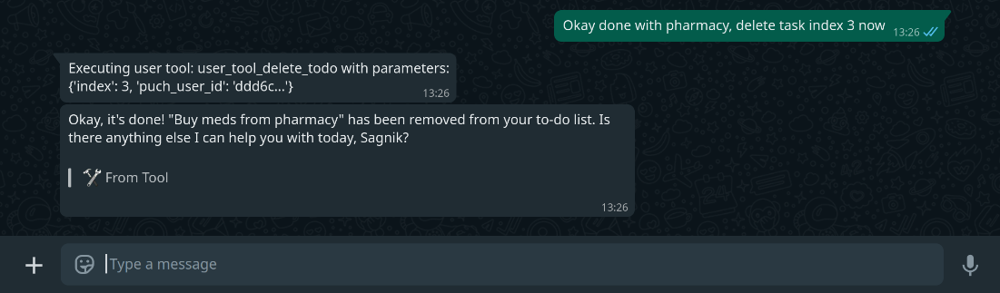

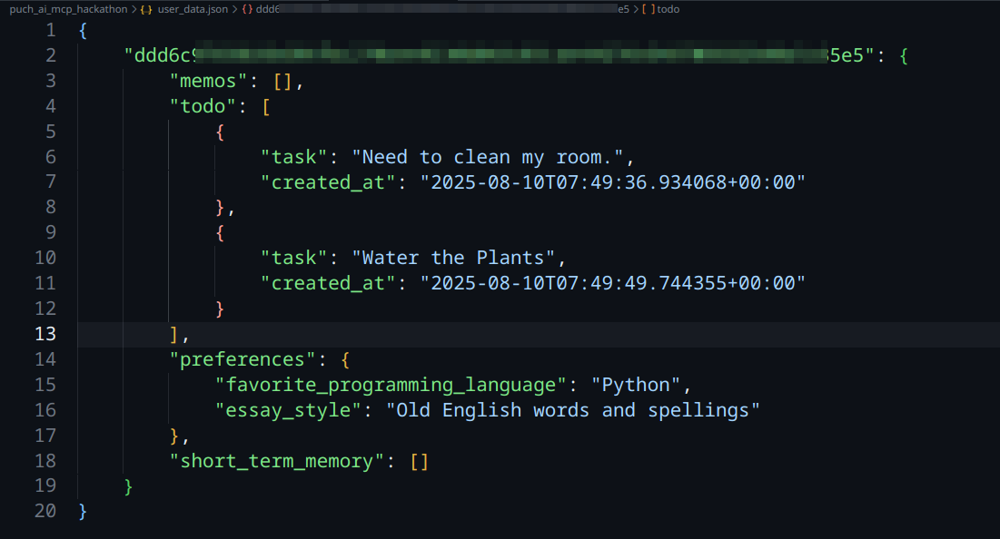

**Description**: Removes a specific task from the user's TODO list by index number.

**Parameters**:
- `puch_user_id` (string): User ID
- `index` (int): The index number of the todo from list_todos (1-based)

**Example Prompts**:
1. *"Delete task number 3 from my todo list."*
2. *"Remove the second item from my tasks."*


---

### NOTE
- Reddit Scraper: 80-second cooldown per user
- Other tools: No cooldown restrictions
- User data stored in `user_data.json`
- Thread-safe file operations with locking
- Atomic write operations with temporary files


# Setup Guide


## Install `uv`


Assuming you have Python installed already.
[`uv`](https://github.com/astral-sh/uv) is a fast Python package installer and environment manager.

Install it with:

```bash
pip install uv
```

## Run

Git clone the repo, populate the `.env` file, navigate inside, and execute this:

```bash
uv run src/main.py
```

By default, it will run on **port 8085**.


## Setup NGROK

### 1. Install ngrok
Download and install ngrok from:  
[https://ngrok.com/download](https://ngrok.com/download)

### 2. Get Your Authtoken
1. Go to: [https://dashboard.ngrok.com/get-started/your-authtoken](https://dashboard.ngrok.com/get-started/your-authtoken)  
2. Copy your authtoken.  
3. Run the following command to add your token:
   ```bash
   ngrok config add-authtoken YOUR_AUTHTOKEN
   ```
4. run `ngrok http 8085`
5. Copy the URL, and type `/mcp connect {copied url}/mcp AUTH_TOKEN`. The AUTH_TOKEN should be same as the one in `.env` file, on [puch.ai/hi](https://puch.ai/hi)


